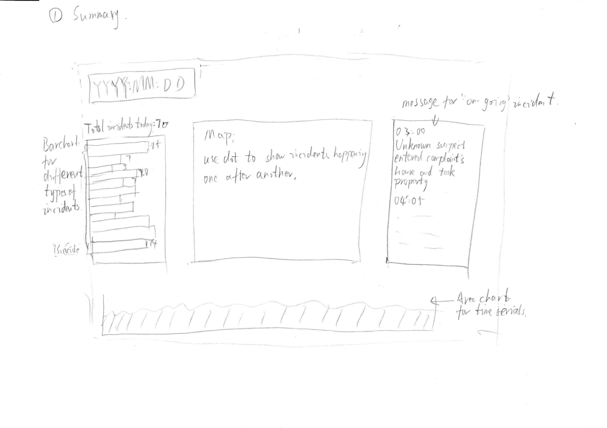
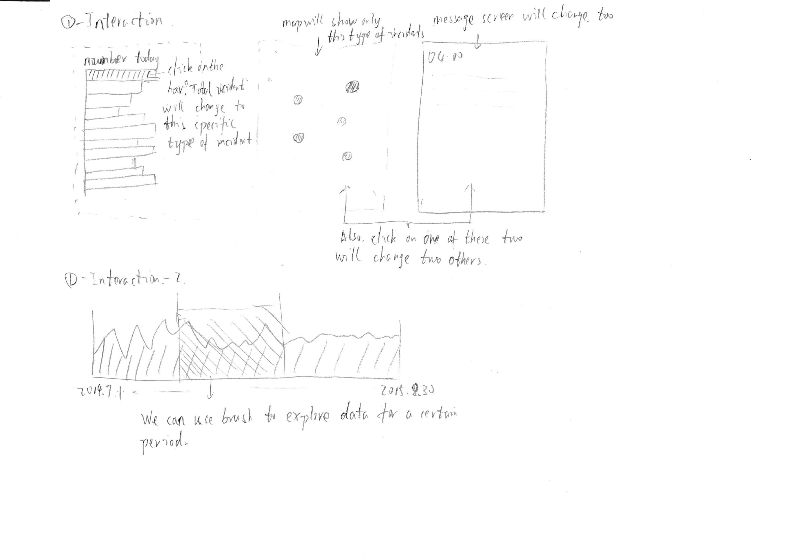
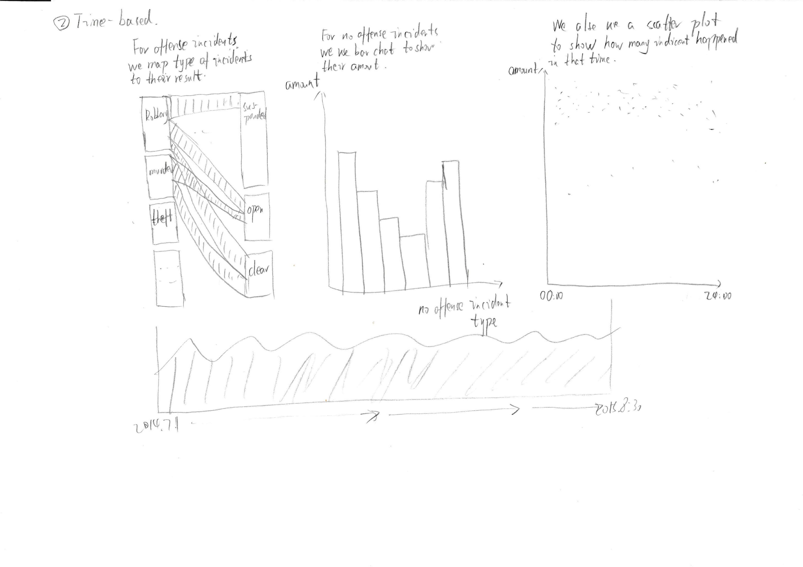
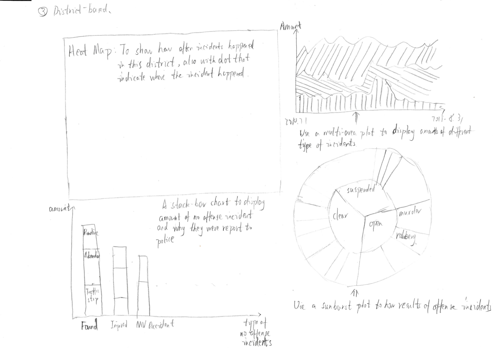
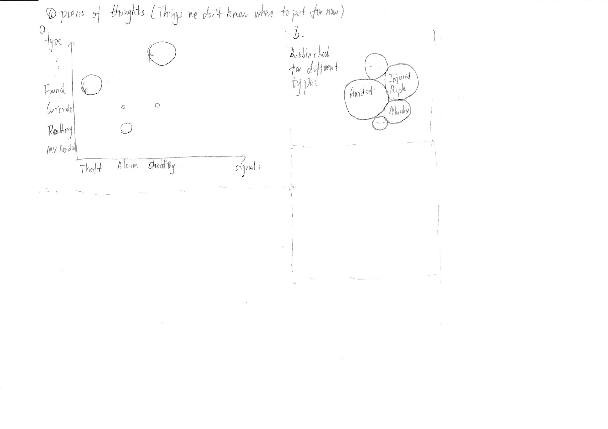

# Final Project Proposal

### Basic Information 
**Project title:** Dallas Recorded Incidents Report 
**Team members:** 
	Xinyu Dai,xdai4@wpi.edu, SarahDai 
	Qian Lu, qlu@wpi.edu, qianlu-wpi 
	Guojun Wu, gwu@wpi.edu, beflew 
**Link to the repository:** [Dallas Recorded Incidents Report](https://github.com/beflew/Dallas_RMS_Incidents)

### Background and Motivation
On the evening of Nov.13th, 2015, a series of the coordinated terrorist attacks occurred in Paris. Pray for Paris here. The need for good record-keeping and information-sharing practices in incidents has taken on added significance in today’s global environment and this big data era. Not only do good records provide crucial internal information, law enforcement agencies now could communicate agency-to-agency and across continents based on these records and reports in order to protect the Nation’s citizens. Nothing is more important to accomplishing that mission than having accessibility to accurate and timely records. Calls for service records and investigative, arrest, criminal identification, detention, and even civil records hold information that by themselves mean little; however, when pieced together with information from other jurisdictions, the result can help with all levels of investigations and aid in safeguarding the Nation. 

Our team focus on the RMS--Records Management System of incidents reporting in America. A RMS consisting of uniform records in incident/offense reports is extremely beneficial for law enforcement agencies, which satisfies operational and management needs at the local level, as well as the informational requirements of the UCR Program(Uniform Crime Reports) for FBI. We searched the open RMS data of several major cities like Boston, San Francisco, etc. and chose Dallas police reported incidents dataset with 135,285 instances.

We chose this data because of the detailed attributes for each incident like the description of the offense type and most of the the time when the incident happened is quite precise. Columns concerning whether the offense involved drug or gang could offer more interesting information for our data analysis and visualization.			
			
		

	
### Project Objectives
The intended audience for this visualization will be primarily people who want to know which area in Dallas has less incidents of a specific type, which potentially indicates the safeness of that area, though perhaps additionally for the more specific subsets of governments, insurance companies, etc. 

We would like to answer the following questions with our visualization:

Can we find a geographic pattern on the map such that which neighborhood/area in Dallas has relatively more or less reported incidents than the others during 2014/2015? 
On a given date, how many incidents are reported in total? Among these incidents, how many incidents are car accidents, robbery, suicide, etc? 

On a given date, which time frame is likely to have more reported incidents? Is this a pattern on a daily basis?
Given a period of time, how many incidents of a specific type were reported? Where did they happen? 

From this final project we would like to not only hone our d3.js skills but also learn the whole process of designing a visualization project from scratch. We will be able to compare the pros and cons of different visualization techniques based on what we have learned throughout this semester, identify what kind of stories we would like to tell from the large dataset, and reflect on how to make the visualization more meaningful to the intended audience.

### Data
We will be acquiring and using data of reported incidents within 2014/2015 from Dallas Police Public Data website. The link is https://www.dallasopendata.com/Police/Dallas-Police-Public-Data-RMS-Incidents/tbnj-w5hb.

We could use the Dallas GIS Map dataset available from the Dallas Police Public Data website to visualize our maps. The link for the Current Dallas Council Districts Adopted in 2013 is https://www.dallasopendata.com/GIS/Current-Council-Districts-Adopted/7q55-efn5. The link for the Dallas Services Location Map is https://www.dallasopendata.com/GIS/Dallas-Services-Locations/hz74-c2yc. 

We would like to convey data mainly based on geographic areas, time periods, and types of incidents.
We will use interactions in the visualization to allow users to explore the data according to their needs.

### Data Processing
First of all, what we have to do is to decide which attributes are useful to us and which not. We split all 113 attributes into 3 groups, “must-have”, “maybe-we-can-use” and “useless”, based on our “must-have” feature and “optional feature”. For example, there are 22 attributes related to when the incident happened. But we really need are 2 of 22, “Startdatetime” and “Stopdatetime”. All other 20 attributes can be removed from our data. Also, who reported incidents and who took care of them aren’t what we concern the most, so attributes related to these can be deleted, too.

Since this data is generated from actual report and people tend to use different words to describe the same thing, we have to merge different values that obviously indicates the same thing together. For instance, for attribute “signal”, there are two values “09-theft” and “0901-theft” which mean the samething.

Then, we have to deal with missing values. For now, our strategy is to drop all row if there is a missing value in this row. But with our ongoing project, we may change our strategy to another, for example, we can use some algorithm like decision tree to determine which value an incident is most probably to have.

### Visualization Design
**Type1**

* Since the data describes things that happened in a city, first visualization came to us is map. We can put everything in a map to see if there is any trends in the data. 

* Another thing we want to know is when these incidents happened, so we make data points that show in the map should be changed based on which day they happened on.
Now, we have “where” and “when”. To form a story, we also need “what”, “who”, “why” and “how”. Normally, we can’t answer why question based on incident report, the thing we can do is put all other 3 into our visualization. Then, we use a text box to show MO of ongoing incidents in the map.

* Finally, the big picture of all incidents is critical. We decide to use a bar chart to show how many incidents happened on the day that showed on the map.

**Type2**

* For prototype 2, we focus more on the “when” part.
Actually, there are two type of incidents, offense and no offense. For offense, we care about whether the case has been solved. For no offense, we may care more about the amount of the incidents.

* Based on above, we use different plot for offense and no offense. For offense incidents, we use parallel chord diagram to show different type of incidents and how they ended. For no offense incidents, we use a simple bar chart to display how many incidents from each type happened.

*  Then, another topic would be interesting is whether there are some difference between day and night. So we use a scatter plot to display how many incidents happened in a certain time. 

**Type3**

* For prototype 3, we focus more on the “when” part.
A heat map will be used to tell audience different rate of incidents in different parts of dallas.

* Instead of a parallel chord diagram, we use a sunburst diagram to show different type of incidents and how they ended. And we use a stack bar chart to show no offense incidents and their signal.

**Piece of thoughts**

### Must-have Features
Considering the 113 attributes, the “must-have” features would be concerning the “where” and “when” and “how” about the recorded incidents. Several attributes would be made use of as follows:

* OffIncident: the description of the offense type
* Point_X, Point_Y: the X,Y coordinates of where the incidents occurred
* StartDateTime, StopDateTime: the start and stop time of an offense

We would have most of the visualization charts in our three prototypes to convey different aspects of the recorded incidents. We would implement the map of Dallas with the places the offense happened as points. We would implement the sunburst chart to show the types of the offense. 

### Optional Features
We want to divide the time when the offense started into several time intervals like day and night and midnight, work days and weekdays, etc to figure out the difference.
We want to come up with several added information for each area like income level, educational degree to distinguish each area. With these information, we want to figure out whether there exists some overlaps in the map between incidents rate and income level.

### Project Schedule
We plan on working on the prototype and the Process Book (hopefully) within the next two weeks (including the Thanksgiving break) and having a working prototype presented on December 3.

After collecting feedbacks from the class and instructor, we can easily move on to implementing the prototype with d3.js and probably Python or R for data processing. 

We will wrap up the project, write documents, and create the video demo over the weekend before the due date December 15.
